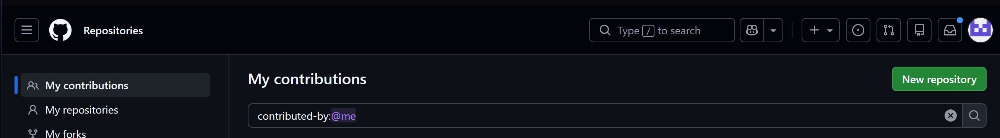
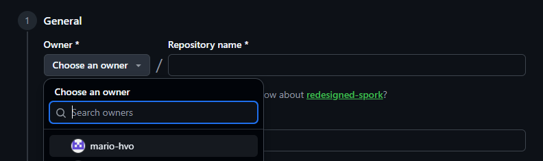
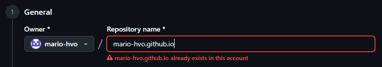
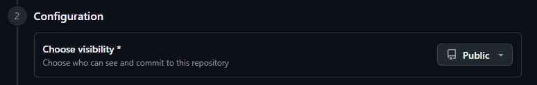
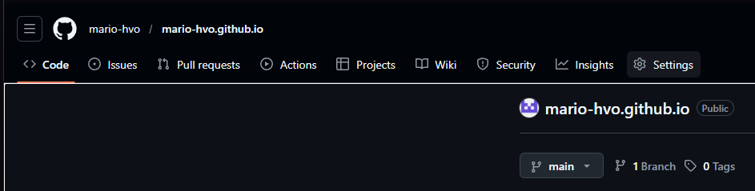
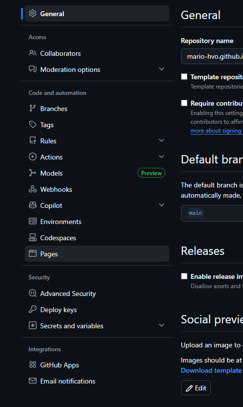

# Jekyll installieren bei GitHub Pages

Offizielle Dokumentation: [GitHub Pages Quickstart](https://docs.github.com/en/pages/quickstart)  
[Jekyll offizielle Website](https://jekyllrb.com/)

GitHub Pages baut Jekyll automatisch – du brauchst **keine** lokale Installation, wenn du nur die GitHub-Variante nutzt.

## Schritt-für-Schritt: Neues Repository erstellen

1. Melde dich bei GitHub an.

2. Gehe links oben ins Menü (drei Striche) → **Repositories**.

3. Rechts oben: Grüner Knopf **New** (neues Repository).

   {: .w-75 .shadow-lg .mx-auto .d-block}

4. **Owner**: Wähle deinen eigenen Account (meist vorausgewählt).

   {: .w-75 .shadow-lg .mx-auto .d-block}

5. **Repository name**: Muss exakt so heißen: `dein-benutzername.github.io` (alles klein, keine Leerzeichen).

   {: .w-75 .shadow-lg .mx-auto .d-block}

   > **Wichtig** – Groß-/Kleinschreibung zählt! Bei falschem Namen funktioniert die Seite nicht.

6. **Visibility**: Wähle **Public** (privat geht bei kostenlosen GitHub Pages nicht für .github.io-Domains).

   {: .w-75 .shadow-lg .mx-auto .d-block}

7. **Initialize this repository with**: Aktiviere **Add a README file** (erleichtert den Start).

8. Klicke unten **Create repository**.

## GitHub Pages aktivieren

9. Im Repository → oben rechts **Settings** (Zahnrad).

   {: .w-75 .shadow-lg .mx-auto .d-block}

10. Links im Menü: **Pages** (unter Code and automation).

    {: .w-75 .shadow-lg .mx-auto .d-block}

11. Unter **Build and deployment** → Source: **Deploy from a branch** (oder GitHub Actions, wenn du Jekyll nutzt)  
    Branch: **main** (oder master) → **/ (root)** → **Save**.

12. Nach 1–2 Minuten: Deine Seite ist live unter  
    **https://dein-benutzername.github.io**

    > Tipp: Erster Build kann bis zu 10 Minuten dauern. Refresh die Seite mehrmals.
